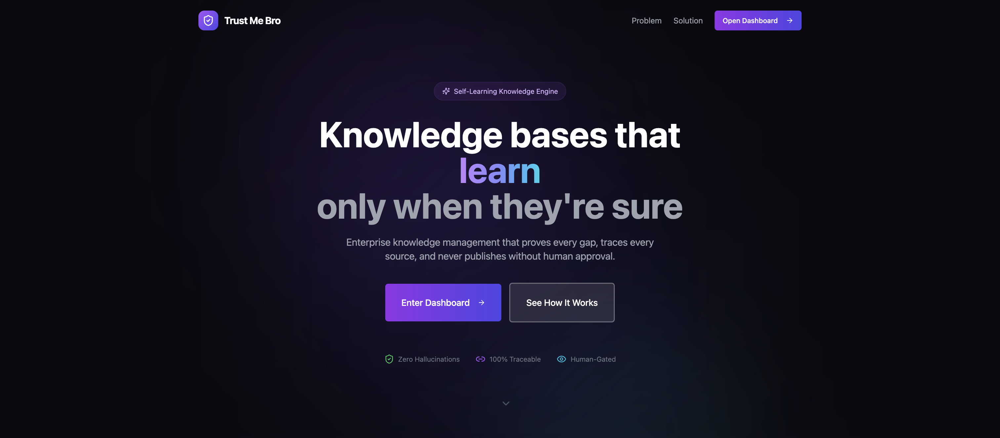

<p align="center">
  
</p>

<h1 align="center">🛡️ Trust Me Bro</h1>

<p align="center">
  <strong>Self-Learning Support Intelligence</strong><br>
  <em>Enterprise knowledge management that proves every gap, traces every source, and never publishes without human approval.</em>
</p>

<p align="center">
  
  
  
</p>

<p align="center">
  <a href="#-quick-start">Quick Start</a> •
  <a href="#-the-problem">The Problem</a> •
  <a href="#-our-solution">Our Solution</a> •
  <a href="#-features">Features</a> •
  <a href="#-architecture">Architecture</a> •
  <a href="#-api-reference">API</a>
</p>

---

## 🎯 What is Trust Me Bro?

**Trust Me Bro (TMB)** is a self-updating knowledge engine that converts resolved support tickets into trusted KB articles — with full evidence traceability, human governance gates, and append-only version history.

> **Built for the RealPage Hackathon:** *Designing a Self-Learning AI System for Support that Builds Trust*

### The 30-Second Demo

```
Ticket arrives → System extracts evidence → Generates KB draft (RLM) 
    → Human approves → Publish v1 → New ticket triggers v2 → Full audit trail
```

---

## 🔥 Quick Start

### Prerequisites
- Python 3.12+
- Node.js 18+
- (Optional) OpenAI API key for enhanced drafts

### 1. Backend (FastAPI)

```bash
# Clone and install
git clone https://github.com/AntAci/Trust-Me-Bro.git
cd Trust-Me-Bro
pip install -r requirements.txt

# Start the API server
python api_server.py
# → Running on http://localhost:8000
```

### 2. Frontend (React + Vite)

```bash
cd public-web
npm install
npm run dev
# → Running on http://localhost:5173
```

### 3. (Optional) Enable AI-Enhanced Drafts

```bash
# Create .env file
echo "OPENAI_API_KEY=sk-your-key-here" > .env
echo "OPENAI_MODEL=gpt-4o-mini" >> .env
```

---

## 😤 The Problem

Traditional support knowledge bases suffer from three critical flaws:

| Problem | Impact |
|---------|--------|
| **Stale Knowledge** | Articles become outdated, agents give wrong answers |
| **No Traceability** | Can't prove where information came from |
| **Uncontrolled Updates** | AI hallucinations enter the knowledge base |

> *"Just trust me, bro"* — what you DON'T want your AI saying when giving operational instructions.

---

## ✨ Our Solution

### 1. 🔍 Prove Every Gap
Before learning anything, the system **proves** a knowledge gap exists using BM25 retrieval. Low confidence = gap detected = learning triggered.

### 2. 📎 Trace Every Source  
Every KB section links back to **evidence units** — exact snippets from tickets, transcripts, scripts, and placeholders. Full provenance graph.

### 3. 🚪 Human Gate Everything
Drafts are **never searchable** until a human approves. Append-only versions preserve full audit history.

---

## 🌟 Features

### Support Console
Real enterprise support workflow simulation with live ticket processing.

### RLM Draft Generation
**Recursive Language Model** drafting extracts evidence section-by-section, with optional OpenAI synthesis for polished articles.

### Provenance Graph
Visual audit trail from published KB → sections → evidence snippets → source records.

### Version History
Append-only version timeline with reviewer attribution and change notes.

### Knowledge Galaxy
Semantic visualization of your knowledge ecosystem — tickets, drafts, articles, and their relationships.

---

## 🏗️ Architecture

```
┌─────────────────────────────────────────────────────────────────┐
│                        TRUST ME BRO                              │
├─────────────────────────────────────────────────────────────────┤
│                                                                  │
│  ┌──────────┐    ┌──────────┐    ┌──────────┐    ┌──────────┐  │
│  │ Tickets  │───▶│ Evidence │───▶│  Draft   │───▶│ Publish  │  │
│  │          │    │ Extract  │    │ Generate │    │          │  │
│  └──────────┘    └──────────┘    └────┬─────┘    └────┬─────┘  │
│                                       │               │         │
│                                       ▼               ▼         │
│                                 ┌──────────┐    ┌──────────┐   │
│                                 │  Human   │    │ Version  │   │
│                                 │  Review  │    │ History  │   │
│                                 └──────────┘    └──────────┘   │
│                                                                  │
├─────────────────────────────────────────────────────────────────┤
│  Trust Signals: Gap Detection │ Lineage Graph │ Audit Trail     │
└─────────────────────────────────────────────────────────────────┘
```

### Tech Stack

| Layer | Technology |
|-------|------------|
| **Frontend** | React 18 + Vite + TypeScript + Tailwind CSS + shadcn/ui |
| **Backend** | Python + FastAPI + SQLAlchemy + Pydantic |
| **Database** | SQLite (demo) / PostgreSQL (production) |
| **AI** | OpenAI GPT-4o-mini (optional) + BM25 retrieval |
| **Visualization** | React Flow + TF-IDF/SVD clustering |

---

## 📁 Repository Structure

```
Trust-Me-Bro/
├── 🌐 public-web/              # Frontend (React + Vite)
│   ├── src/
│   │   ├── pages/              # Dashboard, SupportConsole, Galaxy, etc.
│   │   ├── components/         # UI components
│   │   └── lib/                # API client, utilities
│   └── package.json
│
├── 🔧 api_server.py            # FastAPI REST API
│
├── 📊 db/                      # Database layer
│   ├── __init__.py             # Engine, session, migrations
│   ├── models.py               # ORM models
│   └── schema.sql              # PostgreSQL schema
│
├── 📥 ingestion/               # Data ingestion
│   └── workbook_loader.py      # Excel → SQLite
│
├── 🔍 retrieval/               # BM25 search
│   ├── index.py                # Index builder
│   ├── search.py               # Search API
│   └── query_builder.py        # Ticket → query
│
├── 🕳️ gap/                     # Gap detection
│   └── detect_gap.py           # Threshold logic + logging
│
├── 📝 generation/              # KB generation
│   ├── generator.py            # Draft builder
│   ├── rlm.py                  # RLM mode
│   ├── templates.py            # Markdown renderer
│   ├── lineage.py              # Provenance edges
│   ├── governance.py           # Approve/reject
│   └── publish.py              # Publish + versioning
│
├── 📈 analytics/               # Visualizations
│   ├── galaxy.py               # Knowledge Galaxy layout
│   └── grounding.py            # Evidence grounding
│
├── 🧪 tests/                   # Test suite
├── 📜 scripts/                 # CLI utilities
├── 📁 Data/                    # Source workbook
└── 📋 requirements.txt
```

---

## 🔌 API Reference

### Core Endpoints

| Method | Endpoint | Description |
|--------|----------|-------------|
| `GET` | `/api/metrics` | Dashboard metrics |
| `GET` | `/api/tickets` | List support tickets |
| `GET` | `/api/tickets/{id}/transcript` | Get conversation transcript |
| `POST` | `/api/drafts/generate` | Generate KB draft from ticket |
| `POST` | `/api/drafts/{id}/approve` | Approve draft for publishing |
| `POST` | `/api/drafts/{id}/reject` | Reject draft |
| `POST` | `/api/drafts/{id}/publish` | Publish approved draft |
| `GET` | `/api/articles` | List published articles |
| `GET` | `/api/articles/{id}/versions` | Get version history |
| `GET` | `/api/provenance` | Get provenance graph |
| `GET` | `/api/galaxy` | Get knowledge galaxy data |

### Example: Generate a Draft

```bash
curl -X POST http://localhost:8000/api/drafts/generate \
  -H "Content-Type: application/json" \
  -d '{"ticket_id": "CS-38908386", "generation_mode": "rlm_quality"}'
```

---

## 🎨 UI Screens

### Landing Page
Beautiful dark-themed landing page explaining the product value proposition.

### Dashboard
Metrics overview with Living Knowledge Map visualization and quick actions.

### Support Console
Full enterprise support simulation — select tickets, generate drafts, review, and publish.

### Knowledge Galaxy
Interactive semantic visualization of your entire knowledge ecosystem with neon-styled nodes.

### Provenance Graph
Audit trail visualization showing KB → Evidence → Source relationships.

### Version History
Append-only timeline of all article versions with reviewer attribution.

---

## 🧠 Core Concepts

### Evidence Units
Stable, inspectable snippets extracted from source records:
- Ticket fields (description, resolution, root cause)
- Transcript lines (customer + agent messages)
- Script steps (runbooks, procedures)
- Placeholders (template variables)

### RLM (Recursive Language Model)
Section-by-section draft generation that:
1. Retrieves relevant evidence for each section
2. Synthesizes content with provenance links
3. Verifies against source material
4. Falls back gracefully without OpenAI

### Gap Detection
Conservative BM25-based retrieval that honestly says "I don't know":
- Top-1 score < 8.0 → Knowledge gap
- Average score < 5.0 → Knowledge gap
- Triggers learning event with full audit trail

### Governance Gates
Drafts progress through controlled states:
```
draft → approved → published
     ↘ rejected
```

---

## 📊 Evaluation Metrics

| Metric | Description |
|--------|-------------|
| **Gap Count** | Tickets where retrieval fails threshold |
| **Retrieval Lift** | Score improvement before/after learning |
| **Hit@K** | % tickets with relevant KB in top-K |
| **Gap Closure Rate** | % gaps closed by published articles |

### Sample Results

```
🏆 TRUST-ME-BRO EVALUATION SUMMARY
════════════════════════════════════════════════════════════
📊 RETRIEVAL LIFT METRICS
Tickets evaluated:     20
Gaps BEFORE learning:  8 (40.0%)
Gaps AFTER learning:   2 (10.0%)
Gaps CLOSED:           6 ✅

📈 KEY RESULTS
Gap reduction rate:    75.0%
Avg score improvement: +45.23

🔐 TRUST GUARANTEES
✓ All new KBs have provenance (lineage to source tickets)
✓ Drafts are NEVER searchable until approved
✓ Learning events are logged with full audit trail
✓ Before/after metrics prove measurable improvement
```

---

## 🛣️ Roadmap

### ✅ Phase 1: MVP (Complete)
- Evidence extraction from tickets/transcripts/scripts
- BM25 gap detection with event logging
- RLM draft generation with OpenAI enhancement
- Human governance workflow (approve/reject)
- Publish with append-only versioning
- Full provenance tracking

### ✅ Phase 2: Governance UI (Complete)
- Support Console with ticket selection
- Draft preview and review workflow
- Provenance graph visualization
- Version history timeline
- Knowledge Galaxy semantic view

### 🚧 Phase 3: Production Ready
- Real-time ticket ingestion
- Advanced gap detection (embeddings + ML)
- A/B testing framework
- Evaluation dashboard
- Multi-tenant support

---

## 🤝 Contributing

We welcome contributions! Here's how to get started:

1. Fork the repository
2. Create a feature branch (`git checkout -b feature/amazing`)
3. Make your changes
4. Run tests (`pytest tests/`)
5. Commit with conventional commits (`feat:`, `fix:`, `docs:`)
6. Open a Pull Request

---

## 👥 Team

Built with ❤️ for the **RealPage Hackathon 2026**

---

## 📄 License

MIT License — see [LICENSE](LICENSE) for details.

---

<p align="center">
  <strong>Trust Me Bro</strong> — Because your knowledge base should never hallucinate.
</p>
